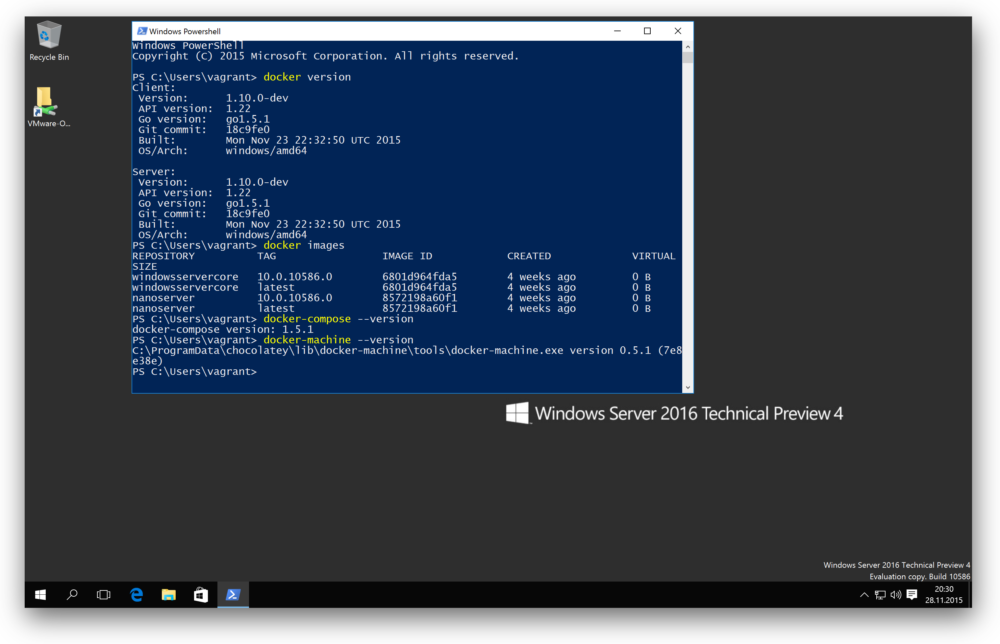

# docker-windows-box

This is a Vagrant box to test Windows Docker Containers on a Windows Server 2016 TP4.



After provisioning the box has the following tools installed:

* docker TP4 engine and client
* docker-machine 0.5.1
* docker-compose 1.5.1
* Chocolatey
* git command line
* ssh client

Tested with VMware Fusion 7.1.3 on a MacBookPro with Retina display. The Vagrant box will be started in fullscreen mode also with Retina support.

## Get the base box

If you don't have the Vagrant `windows_2016_docker` base box you need to create it first with [Packer](https://packer.io). See my [packer-windows](https://github.com/StefanScherer/packer-windows) repo to build the base box.

To build the base box you have to run these commands on your host machine:

```
git clone https://github.com/StefanScherer/packer-windows
cd packer-windows
packer build --only=vmware-iso windows_2016_docker.json
vagrant box add windows_2016_docker windows_2016_docker_vmware.box
```

## Spin up the box

To start the VM with [Vagrant](https://vagrantup.com) run this command

```bash
vagrant up --provider vmware_fusion
```

Now you can work with git as your are used on Mac and Linux ;-)

## Create docker container images

You may clone my [dockerfiles-windows](https://github.com/StefanScherer/dockerfiles-windows) repo and create some container images.

```
git clone https://github.com/StefanScherer/dockerfiles-windows
cd dockerfiles-windows
cd node
.\build.bat
```

## Test the nightly docker engine

You can update the Docker Engine with the script

```
C:\vagrant\scripts\update-nightly-docker.ps1
```

This will stop the Docker service, download the nightly build from https://master.dockerproject.org and restart the service.

## Use Vagrant to control your box

From your host control your Vagrant box with the usual Vagrant workflow:

* vagrant up
* vagrant halt
* vagrant destroy -f
* vagrant snap take
* vagrant snap rollback
* ...
