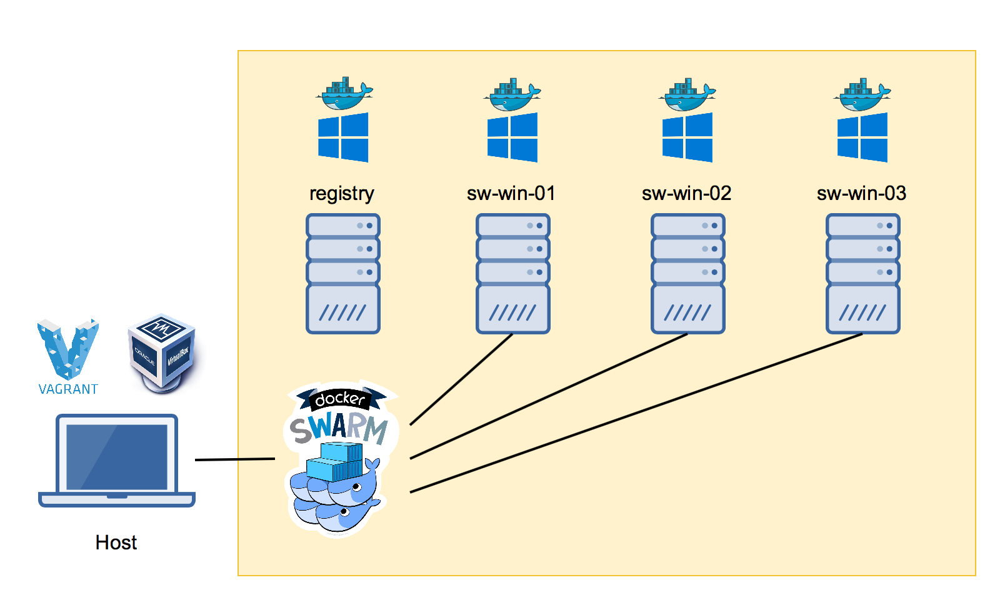

# Windows Docker Swarm demo

This is a local setup using Vagrant with VirtualBox to demonstrate a Windows Docker Swarm with a private (insecure) registry. This work was done for the blog post [Run a local Windows Docker Swarm](https://stefanscherer.github.io/build-your-local-windows-docker-swarm/)



## Vagrant boxes

There are four VM's with the following internal network and IP addresses:

| VM        | IP address     | Memory |
|-----------|----------------|--------|
| registry  | 192.168.38.100 | 1GB    |
| sw-win-01 | 192.168.38.101 | 2GB    |
| sw-win-02 | 192.168.38.102 | 2GB    |
| sw-win-03 | 192.168.38.103 | 2GB    |

Depending on your host's memory you can spin up one or more Windows Server VM's.

### registry

A Linux box with Docker and two containers running:

1. The swarm manager using a token in `config/swarm-token`
2. A registry using the `registry-v2` folder on your host to store the Docker images

### sw-win-01 ...

The Windows Server 2016 TP5 machines that spin up a Swarm container to join the Docker Swarm.
The Docker Engine has connetion to the insecure registry running at `registry:5000`.

## Create the boxes

You need Vagrant, VirtualBox and the [windows_2016_docker](https://github.com/StefanScherer/packer-windows) Vagrant box on your host.
This demo is tested on OSX with VirtualBox 5.0.20.

First create a new swarm token and overwrite the file `config/swarm-token`.
Then just run

```
vagrant up --provider virtualbox
```

and all the four VM's will be created.

## Registry storage

The storage of the private Docker Registry will be in the `registry-v2/docker` directory. On each Windows machine the Docker image `stefanscherer/swarm-windows:1.2.0` will be pulled.

It is save to destroy all the VM's as your Docker images are stored on your host.
Just recreate the registry and one of the Windows Servers and you can pull your own images again.

## Use the Windows Docker swarm

Connect from your host to the Swarm manager which runs in the `registry` VM with the IP address `192.168.38.100`.

```
$ docker -H tcp://192.168.38.100:3375 info
Containers: 3
 Running: 3
 Paused: 0
 Stopped: 0
Images: 9
Server Version: swarm/1.2.0
Role: primary
Strategy: spread
Filters: health, port, dependency, affinity, constraint
Nodes: 3
 sw-win-01: 192.168.38.101:2375
  └ Status: Healthy
  └ Containers: 1
  └ Reserved CPUs: 0 / 2
  └ Reserved Memory: 0 B / 2.1 GiB
  └ Labels: executiondriver=, kernelversion=10.0 14300 (14300.1010.amd64fre.rs1_release_svc.160415-2143), operatingsystem=Windows Server 2016 Datacenter Technical Preview 5, storagedriver=windowsfilter
  └ Error: (none)
  └ UpdatedAt: 2016-05-04T20:12:01Z
  └ ServerVersion: 1.12.0-dev
 sw-win-02: 192.168.38.102:2375
  └ Status: Healthy
  └ Containers: 1
  └ Reserved CPUs: 0 / 2
  └ Reserved Memory: 0 B / 2.1 GiB
  └ Labels: executiondriver=, kernelversion=10.0 14300 (14300.1010.amd64fre.rs1_release_svc.160415-2143), operatingsystem=Windows Server 2016 Datacenter Technical Preview 5, storagedriver=windowsfilter
  └ Error: (none)
  └ UpdatedAt: 2016-05-04T20:12:01Z
  └ ServerVersion: 1.12.0-dev
 sw-win-03: 192.168.38.103:2375
  └ Status: Healthy
  └ Containers: 1
  └ Reserved CPUs: 0 / 2
  └ Reserved Memory: 0 B / 2.1 GiB
  └ Labels: executiondriver=, kernelversion=10.0 14300 (14300.1010.amd64fre.rs1_release_svc.160415-2143), operatingsystem=Windows Server 2016 Datacenter Technical Preview 5, storagedriver=windowsfilter
  └ Error: (none)
  └ UpdatedAt: 2016-05-04T20:12:12Z
  └ ServerVersion: 1.12.0-dev
Plugins:
 Volume:
 Network:
Kernel Version: 4.2.0-27-generic
Operating System: linux
Architecture: amd64
CPUs: 6
Total Memory: 6.299 GiB
Name: 5a5f67806885
```
